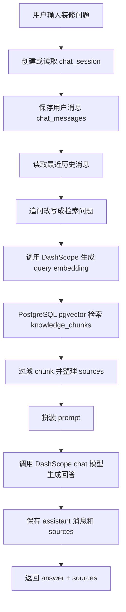

# AI 装修顾问优化文档

## 1. 优化目标

AI 装修顾问的目标不是单纯“能回答”，而是做到接近 GPT 类产品的使用体验：

```text
用户输入问题
系统理解问题
自动检索知识库
结合历史上下文
生成专业、克制、可执行的回答
保存会话记录
失败时能明确告诉用户卡在哪一步
```

本阶段只优化 AI 装修顾问，不改效果图生成模块。

## 2. 当前现状

### 2.1 当前功能链路

当前 `/api/chat` 的主流程如下：



### 2.2 当前涉及代码

```text
apps/web/src/app/api/chat/route.ts
聊天主接口，负责会话、历史、检索、回答、日志。

apps/web/src/lib/ai/dashscope.ts
DashScope embedding 和 chat 模型调用。

apps/web/src/lib/ai/retrieval.ts
知识库向量检索、关键词兜底、sources 整理。

apps/web/src/lib/ai/prompt.ts
知识库上下文、历史上下文、回答策略 prompt 组装。

apps/web/src/lib/ai/intent.ts
识别用户问题意图，决定回答策略和强制召回层级。

apps/web/src/lib/ai/chat-logs.ts
记录每次请求的检索问题、召回统计、错误和耗时。
```

### 2.3 当前数据表

```text
chat_sessions
保存左侧会话记录。

chat_messages
保存用户消息、AI 回复和 sources。

chat_request_logs
保存接口请求日志、检索统计、错误信息和耗时。

knowledge_documents
保存知识库文档。

knowledge_chunks
保存知识库切片、embedding、层级、模块、关键词等检索字段。
```

## 3. 当前主要问题

### 3.1 用户体感慢

当前接口是一次性 JSON 返回：

```text
模型没有完整生成完之前，前端看不到任何内容。
如果模型 20 到 30 秒才返回，用户会感觉页面卡死。
```

这和 GPT 的体验差距最大。GPT 是边生成边展示。

### 3.2 超时错误不够清楚

当前用户可能看到：

```text
The operation was aborted due to timeout
```

这个错误不能告诉用户到底是：

```text
数据库慢
知识库检索慢
DashScope embedding 慢
DashScope chat 慢
网络慢
```

### 3.3 检索和回答耦合较重

当前 `/api/chat` 同时负责：

```text
会话创建
历史读取
追问改写
embedding
知识库检索
prompt 拼接
模型回答
消息保存
日志记录
```

功能能跑，但后续扩展流式输出、工具调用、阶段状态会越来越难维护。

### 3.4 Prompt 上下文可能过长

知识库 chunks、历史消息、回答策略都拼进 prompt。上下文越长：

```text
模型响应越慢
超时概率越高
回答可能变啰嗦
成本也更高
```

### 3.5 缺少阶段状态

当前用户只看到“等待回答”。更好的体验应该展示：

```text
正在理解问题
正在检索知识库
正在生成回答
```

## 4. 优化原则

### 4.1 以装修顾问核心体验为优先

优化目标不是照搬 GPT 的所有能力，而是优先把装修顾问场景里的核心体验做好。所有能力都要服务于下面这些目标：

```text
回答准确
依据清楚
响应可感知
出错可解释
会话可追溯
结果可继续追问
```

流式输出、记忆、工具调用和 Agent Router 都是手段，不是目标。只有当它们能提升装修咨询体验时，才进入实施范围。

### 4.2 知识库优先

AI 装修顾问必须优先基于知识库回答，不直接凭模型常识乱判断。

```text
知识库有依据：结合资料回答。
知识库不足：说明不能直接判断，并让用户补充信息。
```

### 4.3 先优化体验，再做复杂 Agent

当前优化顺序：

```text
第一步：先解决超时和错误不清楚的问题。
第二步：把回答改成流式输出，减少用户等待感。
第三步：增加阶段状态，让用户知道系统正在检索、思考还是生成。
第四步：优化短期记忆，让多轮追问更自然。
第五步：沉淀项目记忆，记录用户户型、预算、风格和重点问题。
第六步：再做 Agent Router，让系统自动判断是否调用知识库、项目记忆或其他工具。
```

这个顺序的原因：

```text
稳定性是底座。
流式输出最能改善用户体感。
阶段状态能降低用户焦虑。
记忆能力决定多轮对话质量。
Agent Router 复杂度最高，必须等前面链路稳定后再做。
```

## 5. 分阶段优化步骤

## 第 1 阶段：稳定性和超时优化

目标：

```text
减少接口 30 秒超时
错误信息更清楚
日志能定位是哪一步慢
```

要做：

```text
1. 给追问改写设置更短超时。
2. 追问改写失败时自动降级为原问题，不阻断主回答。
3. 降低默认召回 chunk 数量。
4. 限制 prompt 上下文长度。
5. 区分 AI_TIMEOUT、CHAT_FAILED 等错误码。
6. chat_request_logs 记录每个阶段耗时。
```

预期效果：

```text
用户不再只看到笼统 timeout。
开发者能从日志知道是检索慢还是模型慢。
简单问题回答速度更快。
```

## 第 2 阶段：流式输出

目标：

```text
让 AI 装修顾问像 GPT 一样边生成边显示。
```

要做：

```text
1. 新增或改造 /api/chat 为 streaming response。
2. 后端使用 ReadableStream 输出 token 或文本片段。
3. 前端聊天组件读取 stream。
4. 回答生成过程中显示光标和加载状态。
5. 流结束后再保存完整 assistant 消息。
6. 流失败时保存错误日志，并允许用户重试。
```

接口形态：

```text
POST /api/chat
返回 text/event-stream 或 ReadableStream
```

前端体验：

```text
用户发送问题后立即看到“正在检索知识库”。
检索完成后开始逐字显示回答。
用户不再面对长时间空白等待。
```

## 第 3 阶段：阶段状态反馈

目标：

```text
让用户知道系统正在做什么，而不是只看到一个 loading。
```

要做：

```text
1. 后端在 stream 中输出阶段事件。
2. 前端展示阶段文案。
3. 阶段失败时返回明确错误。
```

阶段建议：

```text
thinking: 正在理解问题
retrieving: 正在检索知识库
answering: 正在生成回答
done: 回答完成
error: 回答失败
```

## 第 4 阶段：短期记忆优化

目标：

```text
让多轮追问更自然。
```

当前只取最近 6 条消息。后续可以优化为：

```text
1. 最近消息保留。
2. 超长历史做摘要。
3. 会话摘要保存到 chat_sessions 或独立表。
4. 追问改写优先使用摘要 + 最近几条消息。
```

新增字段建议：

```sql
alter table public.chat_sessions
add column if not exists summary text,
add column if not exists memory jsonb not null default '{}'::jsonb;
```

## 第 5 阶段：装修项目记忆

目标：

```text
AI 装修顾问能记住用户的房屋信息、预算、风格和当前问题背景。
```

建议记忆内容：

```text
房屋户型
装修阶段
装修方式
预算区间
偏好风格
重点担忧
已经咨询过的问题
```

后续可新增：

```text
user_project_profiles
```

但本阶段先不建表，先把 chat 稳定性和流式体验做好。

## 第 6 阶段：Agent Router

目标：

```text
让 AI 装修顾问能判断该调用知识库、项目记忆、户型解析结果，还是普通回答。
```

示例：

```text
用户问“水电增项 8000 合理吗？”
-> 检索知识库

用户问“我这个户型厨房动线是不是不好？”
-> 读取户型解析结果 + 检索知识库

用户问“帮我重新生成厨房”
-> 不由装修顾问直接回答，提示去效果图模块或调用空间生成工具
```

本阶段暂不实现，等基础聊天体验稳定后再做。

## 6. 推荐立即执行的改动

第一批先做这些：

```text
1. /api/chat 增加错误分类。
2. 追问改写设置短超时，失败降级。
3. 降低知识库召回数量。
4. 降低 prompt 最大上下文长度。
5. 新增前端错误提示文案。
6. 准备流式输出改造方案。
```

## 7. 验证标准

### 7.1 基础问题

问题：

```text
水电增项 8000 是不是被坑了？
```

预期：

```text
能返回回答
能返回 sources
chat_messages 有 user 和 assistant 两条记录
chat_request_logs 状态为 ok
```

### 7.2 追问

第一问：

```text
卫生间墙砖空鼓怎么办？
```

追问：

```text
那如果已经贴完很久了呢？
```

预期：

```text
系统能结合上文理解“已经贴完很久”的对象是卫生间墙砖空鼓。
```

### 7.3 超时

人为降低超时测试：

```env
DASHSCOPE_TIMEOUT_MS=1000
```

预期：

```text
接口返回 errorCode = AI_TIMEOUT
用户看到“AI 服务响应超时，请稍后重试或缩短问题后再问”
chat_request_logs 有错误记录
```

## 8. 上线注意事项

服务器 `.env.local` 建议：

```env
DASHSCOPE_TIMEOUT_MS=90000
CHAT_REWRITE_TIMEOUT_MS=8000
```

如果只改环境变量：

```bash
pm2 restart snt-zxzsk-web --update-env
```

如果改了代码：

```bash
cd /www/snt-zxzsk
bash scripts/deploy-baota.sh
```

## 9. 当前结论

AI 装修顾问已经具备基础 RAG 能力，但离 GPT 式体验还差：

```text
流式输出
阶段状态
更强记忆
更清楚的错误恢复
更标准的 Agent 调度
```

短期最优先做：

```text
先把 /api/chat 稳定性和超时处理做好。
然后改造成流式输出。
```
