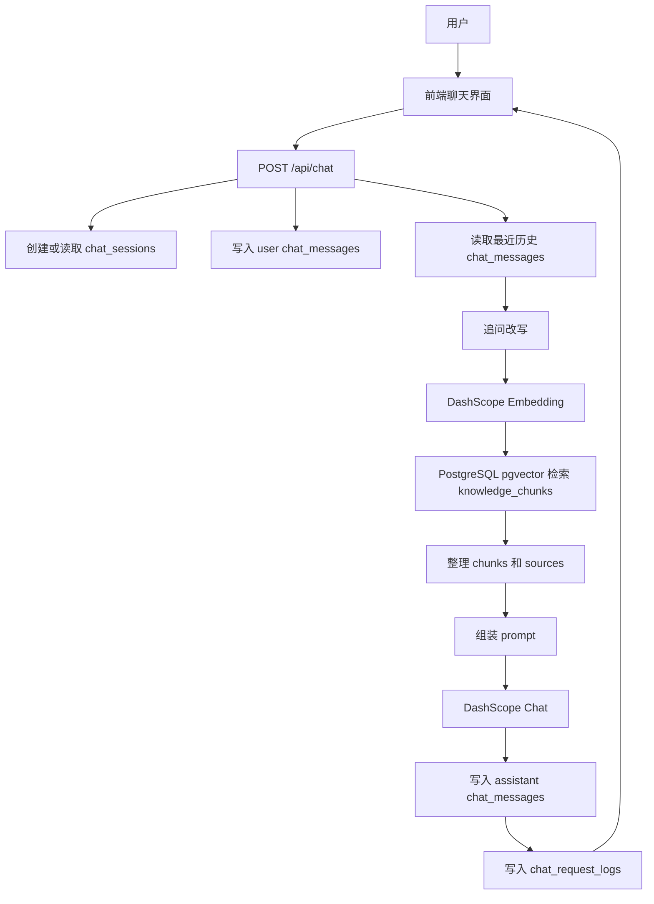
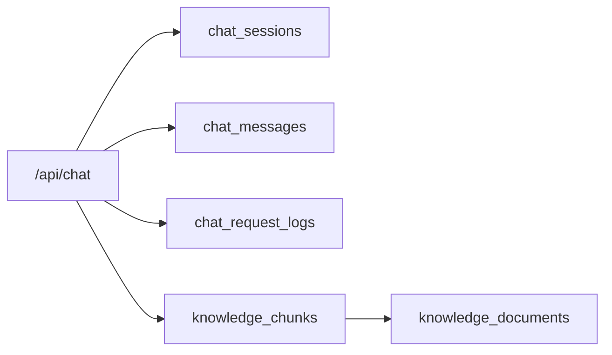
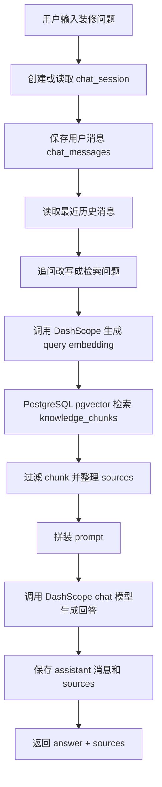

# AI 装修顾问优化文档

## 1. 项目链路调用关系

AI 装修顾问当前是一条 RAG 链路：前端负责会话交互，后端负责会话管理、知识库检索、模型调用和日志记录，PostgreSQL 负责保存知识库、会话和审计数据，DashScope 负责 embedding 与回答生成。

### 1.1 总体调用链路



### 1.2 前端到后端

```text
前端聊天组件
-> POST /api/chat
-> body: { message, sessionId? }
-> response: { ok, sessionId, answer, sources }
```

说明：

```text
message 是用户当前问题。
sessionId 存在时继续旧会话。
sessionId 不存在时后端创建新会话。
answer 是 AI 装修顾问回答。
sources 是本次回答引用的知识库来源。
```

### 1.3 后端内部模块调用

```text
apps/web/src/app/api/chat/route.ts
-> apps/web/src/lib/ai/intent.ts
-> apps/web/src/lib/ai/dashscope.ts
-> apps/web/src/lib/ai/retrieval.ts
-> apps/web/src/lib/ai/prompt.ts
-> apps/web/src/lib/ai/chat-logs.ts
-> apps/web/src/lib/db/postgres.ts
```

职责关系：

```text
route.ts：串联整个聊天请求生命周期。
intent.ts：识别用户问题意图，决定回答策略和强制召回层级。
dashscope.ts：调用 DashScope embedding、chat 和 vision 能力。
retrieval.ts：执行 pgvector 检索、关键词兜底、sources 去重。
prompt.ts：拼装知识库上下文、历史上下文和回答规则。
chat-logs.ts：记录每次请求的耗时、召回统计和错误。
postgres.ts：提供 PostgreSQL 连接池。
```

### 1.4 方法级调用链

下面按一次正常提问的执行顺序说明方法之间的来回调用关系。

```text
POST /api/chat
  -> request.json()
  -> getRequestMessage(body)
  -> getSessionId(body)
  -> createPostgresClient()
  -> createTitleFromMessage(message)
  -> insert chat_sessions
  -> insert chat_messages(user)
  -> rewriteQuestionForRetrieval(message, history)
       -> buildHistoryText(history)
       -> generateChatAnswer(messages, { timeoutMs: CHAT_REWRITE_TIMEOUT_MS })
            -> getDashScopeChatCompletionsUrl()
            -> getDashScopeApiKey()
            -> getChatModel()
            -> createTimeoutSignal(timeoutMs)
            -> parseDashScopeResponse(response)
  -> detectIntentProfile(retrievalQuestion)
  -> createQueryEmbedding(retrievalQuestion)
       -> getDashScopeEmbeddingsUrl()
       -> getDashScopeApiKey()
       -> getEmbeddingModel()
       -> getEmbeddingDimension()
       -> createTimeoutSignal()
       -> parseDashScopeResponse(response)
  -> retrieveKnowledgeForQuestion(queryEmbedding, intentProfile)
       -> matchKnowledgeChunks(queryEmbedding)
            -> createPostgresClient()
            -> toVectorLiteral(queryEmbedding)
            -> public.match_knowledge_chunks(...)
       -> matchKnowledgeChunks(queryEmbedding, { layerFilter })
       -> matchKeywordKnowledgeChunks(intentProfile) 兜底
            -> escapeIlikeValue(keyword)
            -> scoreKeywordChunk(chunk, keywords)
       -> mergeChunks([baseChunks, forcedGroups])
  -> prepareRetrievedKnowledge(retrievalResult.chunks)
       -> isUsefulChunk(chunk)
       -> dedupeSources(chunks, DEFAULT_SOURCE_COUNT)
  -> buildChatMessages(message, chunks, history, intentProfile)
       -> buildKnowledgeContext(chunks)
            -> formatChunk(chunk, index)
       -> buildHistoryContext(history)
       -> buildAnswerPolicyContext(intentProfile)
  -> generateChatAnswer(messages)
       -> getDashScopeChatCompletionsUrl()
       -> getDashScopeApiKey()
       -> getChatModel()
       -> createTimeoutSignal()
       -> parseDashScopeResponse(response)
  -> insert chat_messages(assistant)
  -> update chat_sessions
  -> writeChatRequestLog(...)
       -> createPostgresClient()
       -> insert chat_request_logs
  -> NextResponse.json({ ok, sessionId, answer, sources })
```

### 1.5 route.ts 内部关键方法职责

```text
createStageTimer()
记录本次请求每个阶段耗时，最后写入 chat_request_logs.stage_timings。

getErrorMessage(error)
把 unknown 异常统一变成字符串，保证日志和接口响应可读。

isTimeoutError(error)
判断是否为超时类异常，用于返回 AI_TIMEOUT。

createChatErrorResponse(error)
把底层异常转换成前端可识别的错误结构。

getRequestMessage(body)
校验并截断用户问题。

getSessionId(body)
读取前端传入的会话 ID。

createTitleFromMessage(message)
用第一句话生成默认会话标题。

loadRecentHistory(sessionId)
读取已有会话最近几条 user/assistant 消息。

buildHistoryText(history)
把历史消息转换成追问改写 prompt 使用的文本。

rewriteQuestionForRetrieval(question, history)
把追问改写成完整检索问题；超时则降级为原问题。

POST(request)
AI 装修顾问主入口，串联会话、检索、prompt、模型回答和日志。
```

### 1.6 retrieval.ts 内部关键方法职责

```text
matchKnowledgeChunks(queryEmbedding, options)
调用 PostgreSQL 函数 public.match_knowledge_chunks 做向量召回。

matchKeywordKnowledgeChunks(intentProfile, options)
向量召回为空时，用关键词 ilike 兜底检索。

retrieveKnowledgeForQuestion(queryEmbedding, intentProfile)
检索主入口：普通向量召回 + 意图强制召回 + 关键词兜底。

prepareRetrievedKnowledge(chunks)
过滤过短 chunk，整理进入 prompt 的 chunks 和返回前端的 sources。
```

### 1.7 dashscope.ts 内部关键方法职责

```text
createQueryEmbedding(question)
调用 DashScope embedding，把用户问题转成 query embedding。

generateChatAnswer(messages, options)
调用 DashScope chat 模型，生成追问改写或最终回答。

parseDashScopeResponse(response)
统一解析 DashScope 响应；失败时保留服务端错误 body。

createTimeoutSignal(timeoutMs)
为 DashScope 请求创建超时控制。
```

### 1.8 prompt.ts 内部关键方法职责

```text
buildKnowledgeContext(chunks)
把知识库 chunks 拼成模型上下文，并控制最大长度。

buildHistoryContext(history)
把最近对话整理成简短上下文。

buildAnswerPolicyContext(intentProfile)
根据用户意图生成回答策略。

buildChatMessages(question, chunks, history, intentProfile)
组装最终传给 DashScope chat 的 system/user messages。
```

### 1.9 成功路径的数据写入顺序

```text
1. 如果没有 sessionId：
   insert chat_sessions

2. 先保存用户问题：
   insert chat_messages(role = 'user')

3. 检索、组装 prompt、生成回答。

4. 保存 AI 回复：
   insert chat_messages(role = 'assistant', sources = ...)

5. 更新会话更新时间：
   update chat_sessions set updated_at = now()

6. 保存请求日志：
   insert chat_request_logs(status = 'ok', retrieval_stats, stage_timings, sources)
```

这样设计的原因：

```text
即使模型回答失败，也能看到用户问了什么。
即使日志写入失败，也不影响用户拿到回答。
会话消息和请求日志分开，方便前端恢复会话，也方便后台排查。
```

### 1.10 失败路径的数据写入顺序

```text
1. 如果失败发生在用户消息写入之后：
   chat_messages 中至少保留 user 消息。

2. catch 分支调用 createChatErrorResponse(error)：
   超时返回 AI_TIMEOUT。
   普通异常返回 CHAT_FAILED。

3. catch 分支调用 writeChatRequestLog：
   写入 status = 'error'
   写入 error_message
   写入已采集到的 retrieval_question / intent_profile / retrieval_stats
   写入 stage_timings

4. 返回前端：
   { ok: false, error, errorCode }
```

失败路径的核心目标：

```text
用户能看到可理解错误。
程序员能从 chat_request_logs.stage_timings 判断慢在哪一步。
错误不会静默丢失。
```

### 1.11 数据库调用关系



表作用：

```text
chat_sessions：左侧会话列表。
chat_messages：用户消息、AI 回复和 sources。
chat_request_logs：请求审计、错误排查和阶段耗时。
knowledge_documents：知识库原始文档。
knowledge_chunks：知识库切片和 embedding，是 RAG 检索核心表。
```

### 1.12 外部服务调用关系

```text
DashScope Embedding
用途：把用户问题转成 query embedding。
调用位置：createQueryEmbedding。

DashScope Chat
用途：追问改写、最终回答生成。
调用位置：generateChatAnswer。

PostgreSQL pgvector
用途：按向量相似度检索 knowledge_chunks。
调用位置：matchKnowledgeChunks。
```

### 1.13 当前与效果图模块的边界

```text
AI 装修顾问：负责知识库问答、咨询判断、解释和建议。
效果图生成模块：负责户型图上传、户型解析、全屋效果图、空间效果图。
```

本优化文档只处理 AI 装修顾问链路，不改效果图生成模块。

## 2. 优化目标

AI 装修顾问的目标不是单纯“能回答”，而是做到接近 GPT 类产品的使用体验：

```text
用户输入问题
系统理解问题
自动检索知识库
结合历史上下文
生成专业、克制、可执行的回答
保存会话记录
失败时能明确告诉用户卡在哪一步
```

本阶段只优化 AI 装修顾问，不改效果图生成模块。

## 3. 当前现状

### 3.1 当前功能链路

当前 `/api/chat` 的主流程如下：



### 3.2 当前涉及代码

```text
apps/web/src/app/api/chat/route.ts
聊天主接口，负责会话、历史、检索、回答、日志。

apps/web/src/lib/ai/dashscope.ts
DashScope embedding 和 chat 模型调用。

apps/web/src/lib/ai/retrieval.ts
知识库向量检索、关键词兜底、sources 整理。

apps/web/src/lib/ai/prompt.ts
知识库上下文、历史上下文、回答策略 prompt 组装。

apps/web/src/lib/ai/intent.ts
识别用户问题意图，决定回答策略和强制召回层级。

apps/web/src/lib/ai/chat-logs.ts
记录每次请求的检索问题、召回统计、错误和耗时。
```

### 3.3 当前数据表

```text
chat_sessions
保存左侧会话记录。

chat_messages
保存用户消息、AI 回复和 sources。

chat_request_logs
保存接口请求日志、检索统计、错误信息和耗时。

knowledge_documents
保存知识库文档。

knowledge_chunks
保存知识库切片、embedding、层级、模块、关键词等检索字段。
```

## 4. 当前主要问题

### 4.1 用户体感慢

当前接口是一次性 JSON 返回：

```text
模型没有完整生成完之前，前端看不到任何内容。
如果模型 20 到 30 秒才返回，用户会感觉页面卡死。
```

这和 GPT 的体验差距最大。GPT 是边生成边展示。

### 4.2 超时错误不够清楚

当前用户可能看到：

```text
The operation was aborted due to timeout
```

这个错误不能告诉用户到底是：

```text
数据库慢
知识库检索慢
DashScope embedding 慢
DashScope chat 慢
网络慢
```

### 4.3 检索和回答耦合较重

当前 `/api/chat` 同时负责：

```text
会话创建
历史读取
追问改写
embedding
知识库检索
prompt 拼接
模型回答
消息保存
日志记录
```

功能能跑，但后续扩展流式输出、工具调用、阶段状态会越来越难维护。

### 4.4 Prompt 上下文可能过长

知识库 chunks、历史消息、回答策略都拼进 prompt。上下文越长：

```text
模型响应越慢
超时概率越高
回答可能变啰嗦
成本也更高
```

### 4.5 缺少阶段状态

当前用户只看到“等待回答”。更好的体验应该展示：

```text
正在理解问题
正在检索知识库
正在生成回答
```

## 5. 优化原则

### 5.1 以装修顾问核心体验为优先

优化目标不是照搬 GPT 的所有能力，而是优先把装修顾问场景里的核心体验做好。所有能力都要服务于下面这些目标：

```text
回答准确
依据清楚
响应可感知
出错可解释
会话可追溯
结果可继续追问
```

流式输出、记忆、工具调用和 Agent Router 都是手段，不是目标。只有当它们能提升装修咨询体验时，才进入实施范围。

### 5.2 知识库优先

AI 装修顾问必须优先基于知识库回答，不直接凭模型常识乱判断。

```text
知识库有依据：结合资料回答。
知识库不足：说明不能直接判断，并让用户补充信息。
```

### 5.3 先优化体验，再做复杂 Agent

当前优化顺序：

```text
第一步：先解决超时和错误不清楚的问题。
第二步：把回答改成流式输出，减少用户等待感。
第三步：增加阶段状态，让用户知道系统正在检索、思考还是生成。
第四步：优化短期记忆，让多轮追问更自然。
第五步：沉淀项目记忆，记录用户户型、预算、风格和重点问题。
第六步：再做 Agent Router，让系统自动判断是否调用知识库、项目记忆或其他工具。
```

这个顺序的原因：

```text
稳定性是底座。
流式输出最能改善用户体感。
阶段状态能降低用户焦虑。
记忆能力决定多轮对话质量。
Agent Router 复杂度最高，必须等前面链路稳定后再做。
```

## 6. 分阶段优化步骤

## 第 1 阶段：稳定性和超时优化

目标：

```text
减少接口 30 秒超时
错误信息更清楚
日志能定位是哪一步慢
```

要做：

```text
1. 给追问改写设置更短超时。
2. 追问改写失败时自动降级为原问题，不阻断主回答。
3. 降低默认召回 chunk 数量。
4. 限制 prompt 上下文长度。
5. 区分 AI_TIMEOUT、CHAT_FAILED 等错误码。
6. chat_request_logs 记录每个阶段耗时。
```

预期效果：

```text
用户不再只看到笼统 timeout。
开发者能从日志知道是检索慢还是模型慢。
简单问题回答速度更快。
```

### 6.1.1 优化后的调用链路

```text
POST /api/chat
  -> parse_request
  -> session / history
  -> write_user_message
  -> rewrite_question
       -> 如果超时：降级使用原问题
  -> intent
  -> embedding
  -> retrieval
       -> 普通向量召回
       -> 强制层级召回
       -> 关键词兜底
  -> prepare_knowledge
       -> 过滤过短 chunk
       -> sources 去重并限制数量
  -> prompt
       -> 限制知识库上下文长度
       -> 限制历史上下文长度
  -> answer
       -> 如果超时：返回 AI_TIMEOUT
  -> write_assistant_message
  -> update_session
  -> write_log
       -> 写入 duration_ms
       -> 写入 stage_timings
```

第 1 阶段的核心不是改变回答逻辑，而是让每一步可控、可降级、可排查。

### 6.1.2 改动 1：追问改写独立短超时

涉及文件：

```text
apps/web/src/app/api/chat/route.ts
apps/web/src/lib/ai/dashscope.ts
```

涉及方法：

```text
rewriteQuestionForRetrieval()
generateChatAnswer()
createTimeoutSignal()
```

改了什么：

```text
新增 CHAT_REWRITE_TIMEOUT_MS，默认 8000ms。
generateChatAnswer 支持 options.timeoutMs。
rewriteQuestionForRetrieval 调用 generateChatAnswer 时传入短超时。
```

意义：

```text
追问改写只是提升检索质量的辅助步骤，不应该拖垮整次回答。
如果用户只是普通提问，或者改写模型响应慢，系统应该继续回答，而不是直接 timeout。
```

链路位置：

```text
用户问题
-> rewriteQuestionForRetrieval
-> generateChatAnswer(timeoutMs = CHAT_REWRITE_TIMEOUT_MS)
-> 成功：使用改写后的检索问题
-> 超时：使用原问题继续 embedding 和检索
```

### 6.1.3 改动 2：追问改写失败自动降级

涉及文件：

```text
apps/web/src/app/api/chat/route.ts
```

涉及方法：

```text
rewriteQuestionForRetrieval()
isTimeoutError()
```

改了什么：

```text
rewriteQuestionForRetrieval 内部 catch 超时错误。
如果是 timeout/aborted/timed out，则直接 return question。
非超时异常继续抛出，避免掩盖真实接口问题。
```

意义：

```text
用户追问时，改写失败最多影响检索精度，不应该导致整个 AI 装修顾问不可用。
这属于可降级能力：辅助链路失败，主链路继续。
```

链路位置：

```text
rewrite_question
-> 成功：retrievalQuestion = rewritten
-> 超时：retrievalQuestion = original question
-> 后续 embedding/retrieval/prompt/answer 正常执行
```

### 6.1.4 改动 3：错误分类更清楚

涉及文件：

```text
apps/web/src/app/api/chat/route.ts
```

涉及方法：

```text
getErrorMessage()
isTimeoutError()
createChatErrorResponse()
POST()
```

改了什么：

```text
把底层异常分成两类：
AI_TIMEOUT：AI 服务响应超时。
CHAT_FAILED：普通聊天失败。
```

接口返回：

```json
{
  "ok": false,
  "error": "AI 服务响应超时，请稍后重试或缩短问题后再问。",
  "errorCode": "AI_TIMEOUT"
}
```

意义：

```text
前端不再只显示 The operation was aborted due to timeout。
用户能看懂发生了什么。
程序员也能根据 errorCode 做前端提示、重试按钮或监控统计。
```

链路位置：

```text
任意阶段抛错
-> catch(error)
-> createChatErrorResponse(error)
-> writeChatRequestLog(status = error)
-> NextResponse.json({ ok:false, error, errorCode })
```

### 6.1.5 改动 4：降低知识库召回数量

涉及文件：

```text
apps/web/src/lib/ai/retrieval.ts
```

涉及常量：

```text
DEFAULT_MATCH_COUNT：8 -> 6
DEFAULT_SOURCE_COUNT：6 -> 4
FORCED_MATCH_COUNT：4 -> 3
KEYWORD_FALLBACK_COUNT：12 -> 8
KEYWORD_QUERY_LIMIT：50 -> 30
```

涉及方法：

```text
matchKnowledgeChunks()
matchKeywordKnowledgeChunks()
retrieveKnowledgeForQuestion()
prepareRetrievedKnowledge()
dedupeSources()
```

改了什么：

```text
普通向量召回减少。
强制层级召回减少。
关键词兜底候选减少。
返回前端 sources 数量减少。
```

意义：

```text
召回数量越大，prompt 越长，模型回答越慢。
第 1 阶段先把上下文控制在更稳定的范围，降低超时概率。
sources 减少到 4 条，也能避免前端来源列表过长。
```

链路位置：

```text
queryEmbedding
-> retrieveKnowledgeForQuestion
-> matchKnowledgeChunks(matchCount = 6)
-> forced layer matchCount = 3
-> keyword fallback limit = 8
-> prepareRetrievedKnowledge
-> sources limit = 4
```

### 6.1.6 改动 5：限制 prompt 上下文长度

涉及文件：

```text
apps/web/src/lib/ai/prompt.ts
```

涉及常量：

```text
MAX_CONTEXT_CHARS：9000 -> 6000
MAX_HISTORY_CHARS：3000 -> 1800
```

涉及方法：

```text
buildKnowledgeContext()
buildHistoryContext()
buildChatMessages()
```

改了什么：

```text
知识库资料进入 prompt 的最大字符数降低。
历史对话进入 prompt 的最大字符数降低。
```

意义：

```text
prompt 越长，模型处理越慢，超时概率越高。
装修问答不是越长越好，优先保证高质量资料进入模型。
历史只用于理解追问，不应该把很久以前的对话一直塞给模型。
```

链路位置：

```text
chunks + history + intentProfile
-> buildChatMessages
-> buildKnowledgeContext 限制知识库上下文
-> buildHistoryContext 限制历史上下文
-> generateChatAnswer
```

### 6.1.7 改动 6：新增阶段耗时日志 stage_timings

涉及文件：

```text
apps/web/src/app/api/chat/route.ts
apps/web/src/lib/ai/chat-logs.ts
infra/postgres/schema.sql
```

涉及方法：

```text
createStageTimer()
stageTimer.track()
stageTimer.mark()
stageTimer.snapshot()
writeChatRequestLog()
```

涉及数据库字段：

```sql
alter table public.chat_request_logs
  add column if not exists stage_timings jsonb not null default '{}'::jsonb;
```

记录阶段：

```text
parse_request
session
history
write_user_message
rewrite_question
intent
embedding
retrieval
prepare_knowledge
prompt
answer
write_assistant_message
update_session
write_log
```

意义：

```text
以前只能看到总耗时 duration_ms。
现在可以知道慢在 embedding、retrieval、answer 还是数据库写入。
后续优化不靠猜，可以直接看日志定位。
```

链路位置：

```text
POST /api/chat 开始
-> createStageTimer()
-> 每个关键步骤 stageTimer.track 或 stageTimer.mark
-> writeChatRequestLog(stageTimings = stageTimer.snapshot())
-> chat_request_logs.stage_timings
```

### 6.1.8 改动 7：schema 支持重复执行

涉及文件：

```text
infra/postgres/schema.sql
scripts/deploy-baota.sh
```

改了什么：

```text
schema.sql 中使用 add column if not exists 补 stage_timings。
deploy-baota.sh 每次部署都会执行 schema.sql。
```

意义：

```text
服务器已经部署过一版，也可以直接重复执行 SQL。
不会清空数据。
不会因为字段已存在而中断部署。
```

链路位置：

```text
宝塔部署
-> bash scripts/deploy-baota.sh
-> psql "$DATABASE_URL" -f infra/postgres/schema.sql
-> 自动补齐 chat_request_logs.stage_timings
```

### 6.1.9 第 1 阶段最终落地清单

```text
apps/web/src/app/api/chat/route.ts
- 增加 CHAT_REWRITE_TIMEOUT_MS。
- 增加 createStageTimer。
- 增加 getErrorMessage / isTimeoutError / createChatErrorResponse。
- 追问改写超时降级。
- 每个关键阶段记录耗时。
- catch 分支返回 AI_TIMEOUT / CHAT_FAILED。

apps/web/src/lib/ai/dashscope.ts
- generateChatAnswer 支持 options.timeoutMs。
- createTimeoutSignal 支持传入局部 timeout。

apps/web/src/lib/ai/retrieval.ts
- 降低默认召回数量。
- 降低 sources 数量。
- 降低关键词兜底候选数量。

apps/web/src/lib/ai/prompt.ts
- 降低知识库上下文长度。
- 降低历史上下文长度。

apps/web/src/lib/ai/chat-logs.ts
- ChatRequestLogInput 增加 stageTimings。
- writeChatRequestLog 写入 stage_timings。

infra/postgres/schema.sql
- chat_request_logs 增加 stage_timings jsonb 字段。

docs/AI装修顾问优化.md
- 补充第 1 阶段优化说明、链路、意义和排查 SQL。
```

### 6.1.10 排查方式

```sql
select
  created_at,
  status,
  error_message,
  duration_ms,
  stage_timings
from public.chat_request_logs
order by created_at desc
limit 20;
```

## 第 2 阶段：流式输出

目标：

```text
让 AI 装修顾问像 GPT 一样边生成边显示。
```

要做：

```text
1. 新增或改造 /api/chat 为 streaming response。
2. 后端使用 ReadableStream 输出 token 或文本片段。
3. 前端聊天组件读取 stream。
4. 回答生成过程中显示光标和加载状态。
5. 流结束后再保存完整 assistant 消息。
6. 流失败时保存错误日志，并允许用户重试。
```

接口形态：

```text
POST /api/chat
返回 text/event-stream 或 ReadableStream
```

前端体验：

```text
用户发送问题后立即看到“正在检索知识库”。
检索完成后开始逐字显示回答。
用户不再面对长时间空白等待。
```

### 2.1 本阶段已完成改造

本阶段没有保留旧 JSON 接口。按照当前产品方向，`POST /api/chat` 已直接改造成 SSE 流式接口。

```text
用户提问
-> page.tsx submitQuestion()
-> fetch("/api/chat")
-> route.ts POST()
-> 准备 session / history
-> 写入 user message
-> rewriteQuestionForRetrieval()
-> detectIntentProfile()
-> createQueryEmbedding()
-> retrieveKnowledgeForQuestion()
-> prepareRetrievedKnowledge()
-> buildChatMessages()
-> generateChatAnswerStream()
-> selectAnswerSources()
-> 写入 assistant message + 实际采用依据
-> writeChatRequestLog()
-> done 事件返回完整 answer + sources
```

### 2.2 后端文件和方法

```text
apps/web/src/app/api/chat/route.ts
```

核心方法：

```text
POST()
```

作用：

```text
AI 装修顾问主入口。
现在返回 text/event-stream，不再等待完整回答后一次性返回 JSON。
```

流式事件：

```text
stage：告诉前端当前阶段，例如正在检索知识库、正在生成回答、正在确认回答依据。
session：返回后端创建或确认的会话 ID。
token：返回模型生成的增量文本。
done：返回完整回答、会话 ID、实际采用依据。
error：返回流式过程中的错误。
```

新增方法：

```text
buildEvidenceCandidateText()
```

作用：

```text
把已经检索并进入回答候选池的 chunks 转成短文本。
只保留 chunk_id、来源文件、章节、层级、模块和截断正文。
它服务于回答后的依据筛选，不重新查知识库。
```

新增方法：

```text
parseEvidenceJson()
```

作用：

```text
解析引用判定模型返回的 JSON。
兼容模型返回 Markdown JSON 代码块的情况，避免格式轻微偏差导致整条回答失败。
```

新增方法：

```text
selectAnswerSources()
```

作用：

```text
在回答生成完成后，根据“最终回答 + 候选知识片段”判断哪些资料真正支撑了答案。
这一步根据问题复杂度动态返回 1 到 4 条依据。
如果判定失败，会回退到“知识库检索依据”，保证用户回答不会因为二次判定失败而中断。
```

为什么这样做：

```text
系统检索来源：系统认为可能相关，所以提供给 AI。
实际采用依据：回答完成后，系统再判断这次答案真正用了哪些资料。

这一步提升的是可解释性，不是重新检索知识库。
```

### 2.2.1 回答依据确认放在哪个位置

这一步放在第 2 阶段的后半段，也就是回答已经流式生成完成之后、写入数据库之前。

```text
generateChatAnswerStream()
-> answer 已经完整生成
-> selectAnswerSources()
-> 根据 answer + chunks 确认实际采用依据
-> insert chat_messages(content, sources)
-> writeChatRequestLog(sources)
-> done 事件返回 answer + sources
```

为什么放这里：

```text
1. 放在 retrieval 之前不行：那时还没有答案，只知道候选资料。
2. 放在 answer 生成过程中不合适：流式 token 还没完成，无法判断最终用了哪些资料。
3. 放在写库之后也不合适：sources 已经保存，后续再改会让消息记录和日志不一致。

所以最佳位置是：answer 完成后，写库前。
```

### 2.2.2 动态依据数量规则

依据数量不再固定 4 条，而是根据问题复杂度控制上限。

```text
简单问题：最多 2 条依据。
普通问题：最多 3 条依据。
复杂问题：最多 4 条依据。
```

判断方法在：

```text
apps/web/src/app/api/chat/route.ts
getEvidenceSourceLimit()
```

判断依据：

```text
1. 用户是否要求“详细、步骤、清单、流程、怎么做”。
2. 问题长度是否较长。
3. 是否命中合同、付款、维权、安全风险等复杂标签。
4. 是否同时命中多个意图标签。
```

链路：

```text
detectIntentProfile(retrievalQuestion)
-> 得到 detailLevel 和 labels
-> getEvidenceSourceLimit(retrievalQuestion, intentProfile)
-> 返回 2 / 3 / 4
-> selectAnswerSources(..., sourceLimit)
-> 控制最终 sources 数量
```

### 2.2.3 used 和 retrieved 的区别

现在 sources 增加了 `mode` 字段。

```text
mode = used
表示回答生成后，系统确认这条资料实际支撑了本次回答。
前端展示：实际采用依据 N 条。
```

```text
mode = retrieved
表示二次依据确认失败，系统退回到原始检索命中的候选资料。
前端展示：知识库检索依据 N 条。
```

这样做的意义：

```text
如果二次判断成功，用户看到“实际采用依据”，专业感更强。
如果二次判断失败，系统不冒充实际引用，只展示“知识库检索依据”，表达更诚实。
```

### 2.3 前端文件和方法

```text
apps/web/src/app/page.tsx
```

核心方法：

```text
submitQuestion()
```

作用：

```text
提交问题后立即插入用户消息和空的 assistant 消息。
读取 /api/chat 的 SSE 响应。
收到 token 时逐字追加到 assistant 消息。
收到 done 时用完整 answer 校准内容，并写入实际采用依据 sources。
```

```text
parseServerSentEvent()
```

作用：

```text
解析服务端 SSE 文本块。
把 event/data 转成前端可以处理的结构。
```

```text
apps/web/src/app/components/chat-workspace.tsx
```

展示变化：

```text
原来显示：知识库依据 N 条。
现在根据 sources.mode 动态显示：
- used：实际采用依据 N 条。
- retrieved：知识库检索依据 N 条。

每条依据可展示：
- 知识库层级
- 业务模块
- 相似度
- 来源文件
- 章节
- 支撑判断 reason
```

### 2.4 为什么不是直接展示检索 sources

检索 sources 的意义：

```text
告诉系统：哪些知识资料可能和用户问题有关。
```

实际采用依据的意义：

```text
告诉用户：这次回答里的关键结论主要由哪些资料支撑。
```

例子：

```text
用户问：水电增项 8000 合理吗？

系统可能检索到：
1. 水电报价增项规则
2. 合同漏项风险
3. 防水证据保留
4. 装修公司话术

但最终回答真正用到的可能只有：
1. 水电报价增项规则
2. 合同漏项风险

因此前端应该展示“实际采用依据”，而不是把所有候选来源都叫参考来源。
```

### 2.5 本阶段新增环境变量

```env
CHAT_EVIDENCE_TIMEOUT_MS=10000
```

含义：

```text
回答完成后，二次筛选实际采用依据的超时时间。
默认 10000ms。
它失败不会影响回答，只会回退到原检索来源。
```

## 第 3 阶段：阶段状态反馈

目标：

```text
让用户知道系统正在做什么，而不是只看到一个 loading。
```

要做：

```text
1. 后端在 stream 中输出阶段事件。
2. 前端展示阶段文案。
3. 阶段失败时返回明确错误。
```

阶段建议：

```text
thinking: 正在理解问题
retrieving: 正在检索知识库
answering: 正在生成回答
done: 回答完成
error: 回答失败
```

### 3.1 本阶段已完成改造

本阶段主要补齐前端对 `stage` 事件的消费。后端在第 2 阶段流式接口中已经输出 stage 事件，本阶段让用户能在页面上看到真实阶段。

链路：

```text
route.ts writeEvent("stage", { stage, label })
-> page.tsx parseServerSentEvent()
-> handleEvent("stage")
-> conversationStageLabels[conversationId] = label
-> ChatWorkspace 展示 activeConversationStageLabel
-> 左侧会话生成中标签展示当前阶段
```

### 3.2 修改文件

```text
apps/web/src/app/page.tsx
```

新增状态：

```text
conversationStageLabels
```

作用：

```text
用会话 ID 记录当前生成阶段。
同一个页面中如果多个会话同时生成，不会互相覆盖阶段文案。
```

新增类型：

```text
ChatStreamStagePayload
```

作用：

```text
约束后端 stage 事件的数据结构。
stage 是机器可读阶段名，label 是用户可读文案。
```

新增处理：

```text
handleEvent("stage")
```

作用：

```text
收到后端阶段事件后，把 label 写入 conversationStageLabels。
当前聊天窗口和左侧会话列表都读取这份状态。
```

```text
apps/web/src/app/components/chat-workspace.tsx
```

新增入参：

```text
activeConversationStageLabel
```

作用：

```text
把当前会话阶段显示在聊天窗口底部 loading 区域。
没有阶段文案时，使用“正在检索知识库并生成回答...”兜底。
```

### 3.3 当前可展示阶段

后端当前会发出这些用户可见阶段：

```text
正在准备会话
正在理解问题
正在生成检索向量
正在检索知识库
正在整理回答依据
正在生成回答
正在确认回答依据
```

### 3.4 意义

```text
优化前：
用户只看到一个统一 loading，不知道卡在哪一步。

优化后：
用户可以看到当前阶段，能区分是理解问题、检索知识库、生成回答，还是确认回答依据。
这能降低“接口死循环/页面卡死”的感受。
```

## 第 4 阶段：短期记忆优化

目标：

```text
让多轮追问更自然。
```

当前只取最近 6 条消息。后续可以优化为：

```text
1. 最近消息保留。
2. 超长历史做摘要。
3. 会话摘要保存到 chat_sessions 或独立表。
4. 追问改写优先使用摘要 + 最近几条消息。
```

新增字段建议：

```sql
alter table public.chat_sessions
add column if not exists summary text,
add column if not exists memory jsonb not null default '{}'::jsonb;
```

## 第 5 阶段：装修项目记忆

目标：

```text
AI 装修顾问能记住用户的房屋信息、预算、风格和当前问题背景。
```

建议记忆内容：

```text
房屋户型
装修阶段
装修方式
预算区间
偏好风格
重点担忧
已经咨询过的问题
```

后续可新增：

```text
user_project_profiles
```

但本阶段先不建表，先把 chat 稳定性和流式体验做好。

## 第 6 阶段：Agent Router

目标：

```text
让 AI 装修顾问能判断该调用知识库、项目记忆、户型解析结果，还是普通回答。
```

示例：

```text
用户问“水电增项 8000 合理吗？”
-> 检索知识库

用户问“我这个户型厨房动线是不是不好？”
-> 读取户型解析结果 + 检索知识库

用户问“帮我重新生成厨房”
-> 不由装修顾问直接回答，提示去效果图模块或调用空间生成工具
```

本阶段暂不实现，等基础聊天体验稳定后再做。

## 6. 推荐立即执行的改动

第一批先做这些：

```text
1. /api/chat 增加错误分类。
2. 追问改写设置短超时，失败降级。
3. 降低知识库召回数量。
4. 降低 prompt 最大上下文长度。
5. 新增前端错误提示文案。
6. 准备流式输出改造方案。
```

## 7. 验证标准

### 7.1 基础问题

问题：

```text
水电增项 8000 是不是被坑了？
```

预期：

```text
能返回回答
能返回 sources
chat_messages 有 user 和 assistant 两条记录
chat_request_logs 状态为 ok
```

### 7.2 追问

第一问：

```text
卫生间墙砖空鼓怎么办？
```

追问：

```text
那如果已经贴完很久了呢？
```

预期：

```text
系统能结合上文理解“已经贴完很久”的对象是卫生间墙砖空鼓。
```

### 7.3 超时

人为降低超时测试：

```env
DASHSCOPE_TIMEOUT_MS=1000
```

预期：

```text
接口返回 errorCode = AI_TIMEOUT
用户看到“AI 服务响应超时，请稍后重试或缩短问题后再问”
chat_request_logs 有错误记录
```

## 8. 上线注意事项

服务器 `.env.local` 建议：

```env
DASHSCOPE_TIMEOUT_MS=90000
CHAT_REWRITE_TIMEOUT_MS=8000
```

如果只改环境变量：

```bash
pm2 restart snt-zxzsk-web --update-env
```

如果改了代码：

```bash
cd /www/snt-zxzsk
bash scripts/deploy-baota.sh
```

## 9. 当前结论

AI 装修顾问已经具备基础 RAG 能力，但离 GPT 式体验还差：

```text
流式输出
阶段状态
更强记忆
更清楚的错误恢复
更标准的 Agent 调度
```

短期最优先做：

```text
先把 /api/chat 稳定性和超时处理做好。
然后改造成流式输出。
```
