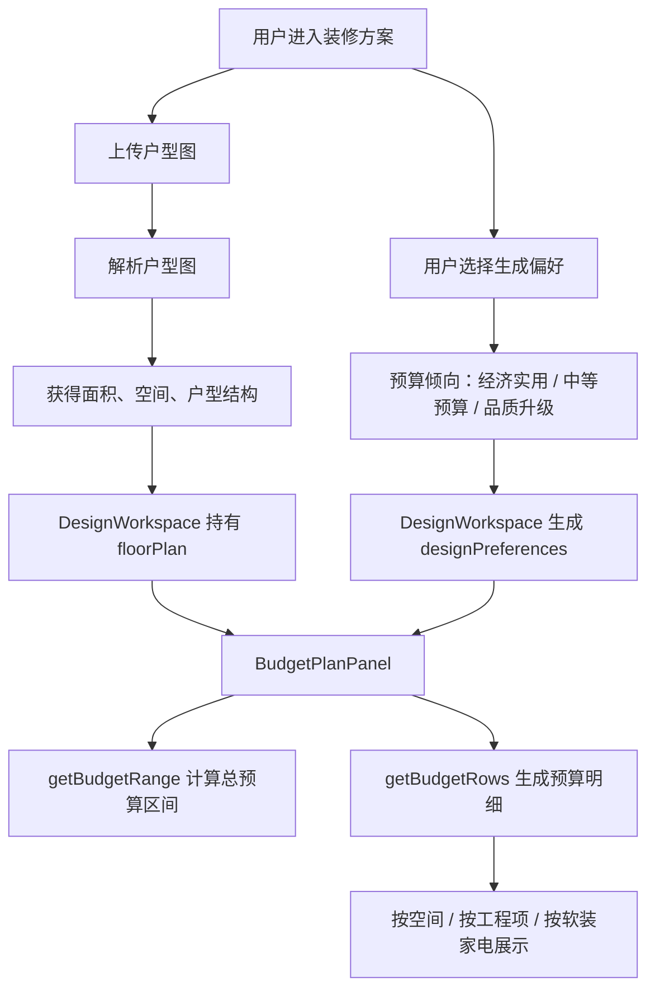

# 方案预算依据方案

## 1. 模块定位

方案预算属于“装修方案”模块下的独立能力，不和效果图、水电位图、避坑提醒混在一起。

它的目标是：在用户上传户型图、选择装修偏好后，系统先给出一版可解释的预算框架，让用户知道钱大概花在哪里。

当前版本是“预算估算级”，不是“正式报价单”。正式报价必须结合现场复尺、施工图、材料品牌型号、工艺标准、城市人工单价和施工合同确认。

## 2. 页面入口和调用链路

当前页面链路如下：



代码位置：

- 页面主容器：`apps/web/src/app/components/design-workspace.tsx`
- Tab 拆分组件：`apps/web/src/app/components/design-plan-tabs.tsx`
- 预算面板：`BudgetPlanPanel`
- 预算区间计算：`getBudgetRange(area, level)`
- 预算面积来源：`getBudgetArea(floorPlan)`
- 预算行生成：`getBudgetRows(view, floorPlan, totalBudget, materials)`
- 按空间预算：`getSpaceBudgetRows(floorPlan, totalBudget, materials)`
- 按工程项预算：`getProjectBudgetRows(totalBudget)`
- 按软装家电预算：`getSoftBudgetRows(totalBudget)`

## 3. 当前数据依据

| 数据 | 来源 | 当前用途 |
| --- | --- | --- |
| `floorPlan.area` | 户型图解析结果 | 计算总预算区间 |
| `floorPlan.spaces` | 户型图解析结果 | 按空间分摊预算 |
| `spaces.name` | 户型图解析结果 | 表格空间名称 |
| `spaces.type` | 户型图解析结果 | 判断空间预算复杂度 |
| `spaces.estimated_area` | 户型图解析结果 | 空间预算权重 |
| `preferences.budget` | 用户引导选择 | 映射预算档位 |
| `preferences.priority` | 用户引导选择 | 自定义调整预算 |
| `MATERIAL_STRATEGY` | 前端规则 | 展示材料策略 |

如果 `floorPlan.area` 为空，当前默认按 100㎡ 临时估算。这样做是为了保证页面不会空白，但页面会提示“面积未解析，当前按 100㎡ 临时预估”。

## 4. 当前预算档位依据

当前预算档位由用户选择的预算倾向决定。

函数：`mapBudgetToQuoteLevel(preferences.budget)`

| 用户选择 | 系统档位 |
| --- | --- |
| 经济实用 | `economic` |
| 中等预算 | `standard` |
| 品质升级 | `premium` |
| 未选择 | 默认 `standard` |

当前城市参考单价：

| 档位 | 单价区间 |
| --- | --- |
| 经济实用 | 1200 ~ 1580 元/㎡ |
| 中等预算 | 1680 ~ 2060 元/㎡ |
| 品质升级 | 2300 ~ 3200 元/㎡ |

当前单价是前端估算参数，不是数据库真实价格。后续正式化后，应改为从城市报价库、材料库和施工项价格库读取。

## 5. 总预算计算依据

函数：`getBudgetRange(area, level)`

计算方式：

```text
最低预算 = 面积 × 当前档位最低单价
最高预算 = 面积 × 当前档位最高单价
推荐预算 = (最低预算 + 最高预算) / 2
```

取整方式：

- 总预算区间按 1000 元取整。
- 推荐预算按 100 元取整。
- 表格行预算按 100 元取整。

这样做的原因：

- 预算本身是估算，个位数没有意义。
- 按百元或千元展示更符合用户理解。
- 避免用户误以为系统给的是精确报价。

## 6. 自定义调整依据

函数：`getBudgetAdjustedValue(recommendedBudget, preferences)`

当前逻辑：

| 条件 | 调整 |
| --- | --- |
| 经济实用 | 推荐预算 × 0.94 |
| 中等预算 | 推荐预算 × 0.97 |
| 品质升级 | 推荐预算 × 1.08 |
| 优先级是预算控制 | 再 × 0.96 |

这个字段的意义：

- 让用户看到预算会跟随自己的倾向变化。
- 为后续“拖动预算、重新分配空间费用”预留入口。
- 当前只是轻量调整，不代表最终报价。

## 7. 材料策略依据

当前不同预算档位对应不同材料策略。

| 档位 | 材料策略 |
| --- | --- |
| 经济实用 | 环保乳胶漆、强化复合木地板、常规瓷砖、成品柜体、基础灯具 |
| 中等预算 | 环保乳胶漆、多层实木复合地板、中档瓷砖、定制柜体、局部无主灯 |
| 品质升级 | 艺术涂料、实木复合地板、大规格砖、全屋定制柜、无主灯系统 |

当前材料策略用于：

- 顶部预算说明。
- 表格底部材料策略展示。
- 空间明细里的材料项提示。

后续正式化后，材料策略应该拆成具体品牌、型号、规格、单价、损耗率和供应商。

## 8. 按空间预算依据

函数：`getSpaceBudgetRows(floorPlan, totalBudget, materials)`

按空间预算的目标是回答用户：

“每个房间大概要花多少钱？”

计算步骤：

1. 优先读取 `floorPlan.spaces`。
2. 如果没有解析空间，使用兜底空间：客厅、主卧、次卧、厨房、卫生间、阳台、玄关。
3. 每个空间先识别类型。
4. 如果空间有 `estimated_area`，优先按面积作为权重。
5. 如果没有面积，按空间复杂度权重分摊。
6. 根据权重分配总预算。
7. 按空间类型拆人工费和材料费。

空间复杂度权重：

| 空间类型 | 权重依据 |
| --- | --- |
| 厨房 | 权重较高，涉及水电、瓷砖、橱柜、设备 |
| 卫生间 | 权重较高，涉及防水、给排水、洁具、瓷砖 |
| 客厅 | 中高权重，面积大，涉及地面、墙顶面、灯光 |
| 卧室 | 中等权重，涉及墙面、地面、柜体衔接 |
| 阳台 | 中低权重，涉及防水、地砖、洗衣机点位 |
| 玄关 | 较低权重，涉及收口、开关、柜体衔接 |

预算建议规则：

| 条件 | 建议 |
| --- | --- |
| 厨房、卫生间 | 不建议改动 |
| 占比大于等于 18% | 适中，建议保留 |
| 其他 | 可省 |

这样做的原因：

- 厨卫、水电、防水属于质量关键项，不能轻易压缩。
- 客厅等面积大空间可以根据风格和材料做适度调整。
- 阳台、玄关、软装类预算更适合做弹性控制。

## 9. 按工程项预算依据

函数：`getProjectBudgetRows(totalBudget)`

按工程项预算的目标是回答用户：

“钱花在了哪些施工环节？”

当前工程项比例：

| 工程项 | 占比 |
| --- | --- |
| 拆改与保护 | 8% |
| 水电工程 | 18% |
| 防水工程 | 8% |
| 泥瓦工程 | 24% |
| 木作油漆 | 23% |
| 安装收口 | 19% |

其中：

- 水电工程、防水工程标记为“优先保障”。
- 其他工程项默认“适中，建议保留”。

这样做的原因：

- 水电和防水后期返工成本高，不能只按最低价压缩。
- 泥瓦、木作、油漆决定基础质量和观感。
- 安装收口影响最终落地细节。

## 10. 按软装家电预算依据

函数：`getSoftBudgetRows(totalBudget)`

按软装家电预算的目标是回答用户：

“除了硬装，后续还要准备多少钱？”

当前规则：

```text
软装家电预算 = 推荐预算 × 35%
```

当前软装家电比例：

| 类目 | 占比 |
| --- | --- |
| 定制柜体 | 36% |
| 灯具开关 | 16% |
| 窗帘软装 | 15% |
| 家具配置 | 20% |
| 家电预留 | 13% |

定制柜体标记为“重点控制”，其他项标记为“可省”。

这样做的原因：

- 定制柜体金额通常高，而且和收纳、尺寸、板材环保强相关。
- 灯具、窗帘、家具、家电具有更强的弹性，适合根据预算分阶段购买。

## 11. 页面展示依据

当前预算页面分为四层。

### 11.1 顶部四张卡片

| 卡片 | 含义 |
| --- | --- |
| 总预算区间 | 面积 × 当前档位单价区间 |
| 推荐预算值 | 区间中位数 |
| 自定义调整后 | 根据用户预算倾向和预算控制偏好调整 |
| 城市参考价 | 当前档位的单价区间 |

### 11.2 提示条

用于说明当前预算的原则：

- 有效果图时：优先保障水电、防水、五金等关键项。
- 没有效果图时：先给出预算框架，生成效果图后继续细化。

### 11.3 维度切换

| Tab | 用途 |
| --- | --- |
| 按空间 | 用户看每个房间多少钱 |
| 按工程项 | 用户看施工环节钱怎么分 |
| 按软装家电 | 用户看硬装之外还要准备多少钱 |

### 11.4 明细表

表格字段：

- 名称。
- 总预算。
- 人工费。
- 材料费。
- 占比。
- 预算建议。
- 展开明细。

展开明细展示当前行对应的关键材料或施工项。

## 12. 正式化升级方案

当前预算是前端估算。要升级为正式报价能力，需要后端落库和报价规则。

### 12.1 预算方案主表

```sql
create table if not exists public.design_budget_plans (
  id uuid primary key default gen_random_uuid(),
  project_id uuid not null references public.design_projects(id) on delete cascade,
  floor_plan_id uuid references public.design_floor_plans(id) on delete set null,
  title text not null default '默认预算方案',
  budget_level text not null default 'standard',
  city text not null default '北京',
  area numeric,
  min_budget integer,
  max_budget integer,
  recommended_budget integer,
  adjusted_budget integer,
  status text not null default 'draft',
  created_at timestamptz not null default now(),
  updated_at timestamptz not null default now()
);

comment on table public.design_budget_plans is '装修预算方案主表，一套装修方案可以有多版预算。';
comment on column public.design_budget_plans.project_id is '所属装修方案项目 ID。';
comment on column public.design_budget_plans.floor_plan_id is '预算基于哪一张户型图生成。';
comment on column public.design_budget_plans.budget_level is '预算档位：economic 经济实用、standard 中等预算、premium 品质升级。';
comment on column public.design_budget_plans.city is '报价参考城市。';
comment on column public.design_budget_plans.area is '预算计算使用的建筑面积或套内面积。';
comment on column public.design_budget_plans.status is '预算状态：draft 草稿、confirmed 已确认、archived 已归档。';
```

### 12.2 预算明细表

```sql
create table if not exists public.design_budget_items (
  id uuid primary key default gen_random_uuid(),
  plan_id uuid not null references public.design_budget_plans(id) on delete cascade,
  view_type text not null,
  item_name text not null,
  room_name text,
  project_type text,
  quantity numeric,
  unit text,
  unit_price integer,
  labor_cost integer not null default 0,
  material_cost integer not null default 0,
  total_cost integer not null default 0,
  ratio numeric,
  advice text,
  sort_order integer not null default 0,
  created_at timestamptz not null default now(),
  updated_at timestamptz not null default now()
);

comment on table public.design_budget_items is '预算明细表，记录按空间、工程项、软装家电拆分后的费用。';
comment on column public.design_budget_items.plan_id is '所属预算方案 ID。';
comment on column public.design_budget_items.view_type is '预算维度：space 按空间、project 按工程项、soft 按软装家电。';
comment on column public.design_budget_items.item_name is '预算项名称，例如客厅、水电工程、定制柜体。';
comment on column public.design_budget_items.room_name is '关联空间名称，按空间预算时使用。';
comment on column public.design_budget_items.project_type is '工程或材料类型。';
comment on column public.design_budget_items.quantity is '工程量或材料数量。';
comment on column public.design_budget_items.unit is '计量单位，例如㎡、米、项、个。';
comment on column public.design_budget_items.unit_price is '单价，单位元。';
comment on column public.design_budget_items.labor_cost is '人工费，单位元。';
comment on column public.design_budget_items.material_cost is '材料费，单位元。';
comment on column public.design_budget_items.total_cost is '总价，单位元。';
comment on column public.design_budget_items.ratio is '当前项占总预算比例。';
comment on column public.design_budget_items.advice is '预算建议，例如可省、优先保障、建议保留。';
```

### 12.3 城市价格库

后续需要补城市价格库：

```sql
create table if not exists public.design_price_references (
  id uuid primary key default gen_random_uuid(),
  city text not null,
  budget_level text not null,
  category text not null,
  item_name text not null,
  unit text not null,
  min_unit_price integer not null,
  max_unit_price integer not null,
  source text,
  effective_date date,
  created_at timestamptz not null default now()
);

comment on table public.design_price_references is '城市报价参考库，用于预算方案按城市、档位、项目读取参考单价。';
comment on column public.design_price_references.city is '城市名称。';
comment on column public.design_price_references.budget_level is '预算档位。';
comment on column public.design_price_references.category is '报价分类，例如硬装、主材、人工、软装、家电。';
comment on column public.design_price_references.item_name is '报价项目名称。';
comment on column public.design_price_references.unit is '计量单位。';
comment on column public.design_price_references.min_unit_price is '最低参考单价。';
comment on column public.design_price_references.max_unit_price is '最高参考单价。';
comment on column public.design_price_references.source is '报价来源。';
comment on column public.design_price_references.effective_date is '价格生效日期。';
```

## 13. 当前结论

当前方案预算的依据是：

1. 户型解析面积。
2. 用户预算倾向。
3. 用户装修重点。
4. 前端内置城市单价区间。
5. 前端内置空间复杂度权重。
6. 前端内置工程项比例。
7. 前端内置软装家电比例。

当前能解决的问题：

- 用户能看到预算区间。
- 用户能看到推荐预算。
- 用户能按空间、工程项、软装家电理解钱花在哪里。
- 用户能看到哪些项建议保留，哪些项可省。

当前不能解决的问题：

- 不能作为正式合同报价。
- 不能替代现场复尺。
- 不能保证材料品牌和单价真实。
- 不能自动计算真实工程量。

下一步建议：

先把预算方案和预算明细落库，再接城市价格库和材料库；最后把效果图里的材料识别结果、水电点位数量、空间面积和施工项联动起来，形成真正可追溯的报价。
