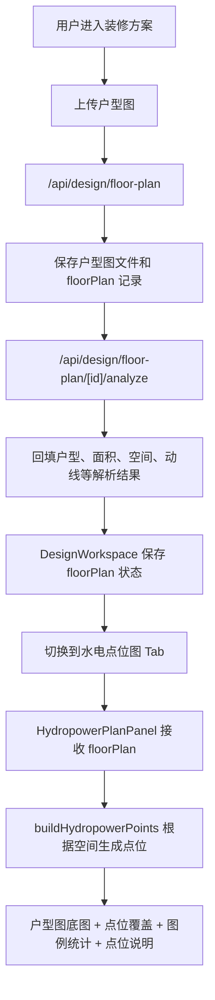

# 水电位图依据方案

## 1. 模块定位

水电位图属于“装修方案”模块下的独立能力，不和 AI 装修顾问、不和效果图生成混在一起。

它的目标不是直接替代施工图，而是在用户上传户型图并完成户型解析后，先给出一版可视化的水电点位规划建议：

- 让用户知道每个空间大概需要哪些开关、插座、照明、给水、排水、强弱电、空调点位。
- 让用户能在户型图上看到点位分布，而不是只看文字清单。
- 后续可以继续升级为“可编辑、可保存、可导出、可让设计师确认”的正式水电方案。

当前版本是“规划建议级”，不是“施工落位级”。施工前必须结合现场尺寸、原始强弱电箱、上下水管位、梁柱、承重墙和施工图纸确认。

## 2. 页面入口和调用链路

当前页面链路如下：



代码位置：

- 页面主容器：`apps/web/src/app/components/design-workspace.tsx`
- Tab 拆分组件：`apps/web/src/app/components/design-plan-tabs.tsx`
- 水电点位面板：`HydropowerPlanPanel`
- 点位生成入口：`buildHydropowerPoints(floorPlan)`
- 单空间点位生成：`createHydropowerPointsForSpace(space, spaceIndex)`

## 3. 当前数据依据

当前水电位图主要依据 `floorPlan` 里的数据。

| 数据 | 来源 | 当前用途 |
| --- | --- | --- |
| `file_url` | 用户上传的户型图 | 作为水电位图底图展示 |
| `spaces` | 户型图解析结果 | 判断有哪些空间，需要生成哪些点位 |
| `spaces.name` | 户型图解析结果 | 展示房间名称，用于房间筛选 |
| `spaces.type` | 户型图解析结果 | 判断空间类型：厨房、卫生间、客厅、卧室、阳台、玄关 |
| `area` | 户型图解析结果 | 暂不直接参与点位数量计算，后续可用于点位密度 |
| `circulation` | 户型图解析结果 | 暂不直接参与点位计算，后续可用于开关双控和过道点位 |

当前还没有真实墙体坐标、门窗坐标、给排水原始管位坐标，所以点位暂时按“空间类型 + 经验规则 + 百分比坐标”生成。

## 4. 当前点位生成规则

当前代码把空间先归类，再按空间类型生成点位。

### 4.1 空间归类依据

函数：`normalizeHydropowerRoomKind(space)`

规则：

| 识别关键词 | 归类 |
| --- | --- |
| 厨、kitchen | 厨房 |
| 卫、bath、toilet、洗手间 | 卫生间 |
| 客、living | 客厅 |
| 卧、bed、儿童房、老人房 | 卧室 |
| 阳台、balcony | 阳台 |
| 玄关、入户、走廊、过道 | 入户/过道 |
| 其他 | 默认空间 |

这样做的原因：

- AI 解析返回的空间类型可能不稳定，有时是中文，有时是英文，有时是自然语言。
- 前端先做关键词归类，可以让页面在后端结果不完全标准时仍然工作。
- 后续正式化后，应该由后端返回标准枚举，例如 `living_room`、`kitchen`、`bathroom`。

### 4.2 各空间默认点位依据

函数：`getHydropowerTemplatesForSpace(space)`

当前规则：

| 空间 | 默认点位 |
| --- | --- |
| 客厅 | 电视墙插座、双控开关、主照明、空调点位 |
| 厨房 | 给水点、排水点、台面小厨电插座、厨房照明 |
| 卫生间 | 给水点、排水点、镜柜插座、卫生间照明 |
| 卧室 | 床头五孔插座、卧室双控开关、卧室照明、卧室空调点位 |
| 阳台 | 阳台给水点、阳台排水点、洗衣机插座 |
| 玄关/过道 | 强电箱、弱电箱、玄关开关 |
| 其他空间 | 基础插座、照明点位、门口开关 |

这些规则的业务依据：

- 厨房和卫生间优先考虑给排水、防水、插座安全。
- 客厅优先考虑电视墙、照明、空调和进入动线。
- 卧室优先考虑床头使用、双控和夜间动线。
- 阳台优先考虑洗衣机、烘干机、清洁龙头和排水。
- 玄关优先考虑强电箱、弱电箱、入户照明控制。

## 5. 当前坐标依据

当前版本没有真实施工坐标，所以采用百分比坐标。

函数：

- `HYDROPOWER_ROOM_ANCHORS`
- `HYDROPOWER_POINT_OFFSETS`
- `clampHydropowerPosition(value)`

逻辑：

1. 把户型图抽象成一个 3x3 的视觉网格。
2. 每个空间按顺序落到一个网格锚点。
3. 同一个空间内的多个点位围绕锚点做轻微偏移。
4. 点位坐标限制在 8% 到 92% 之间，避免贴边被裁切。

这样做的意义：

- 当前阶段可以让用户看到“水电点位图长什么样”。
- 点位不会全部堆在一起。
- 能支持类型筛选、房间筛选和点位说明。

当前不足：

- 不能保证点位贴合真实墙面。
- 不能判断是否压到门窗、柜体、承重墙。
- 不能直接给施工队使用。

## 6. 页面展示依据

当前水电位图页面由四块组成。

### 6.1 顶部说明

展示当前状态：

- 是否使用上传户型图底图。
- 当前共有多少个建议点位。
- 明确提示“施工前需要现场核对”。

### 6.2 筛选区

支持按点位类型筛选：

- 全部
- 开关
- 插座
- 照明
- 给水点
- 排水点
- 强电箱
- 弱电箱
- 空调点位

支持按房间筛选：

- 全部房间
- 户型解析出来的空间
- 系统补充的入户区

### 6.3 主图区域

展示逻辑：

- 有 `floorPlan.file_url`：使用用户上传的户型图作为底图。
- 没有 `floorPlan.file_url`：展示兜底房间格子，避免页面空白。
- 点位以圆形标记覆盖在底图上。
- 点击点位后右侧说明同步更新。

### 6.4 右侧说明

展示内容：

- 图例与统计。
- 当前点位类型。
- 当前点位所在房间。
- 当前点位图上位置。
- 当前点位用途说明。
- 使用提示。

## 7. 正式化升级方案

当前版本是“前端建议规则”。要升级为正式能力，需要补后端数据和规则。

### 7.1 第一阶段：保存水电方案

新增表建议：

```sql
create table if not exists public.design_hydropower_plans (
  id uuid primary key default gen_random_uuid(),
  project_id uuid not null references public.design_projects(id) on delete cascade,
  floor_plan_id uuid not null references public.design_floor_plans(id) on delete cascade,
  title text not null default '默认水电点位方案',
  status text not null default 'draft',
  source text not null default 'ai_suggestion',
  created_at timestamptz not null default now(),
  updated_at timestamptz not null default now()
);

comment on table public.design_hydropower_plans is '水电点位方案主表，一套户型可以生成多版水电点位方案。';
comment on column public.design_hydropower_plans.project_id is '所属装修方案项目 ID。';
comment on column public.design_hydropower_plans.floor_plan_id is '基于哪一张户型图生成。';
comment on column public.design_hydropower_plans.status is '方案状态：draft 草稿、confirmed 已确认、archived 已归档。';
comment on column public.design_hydropower_plans.source is '方案来源：ai_suggestion AI建议、manual 用户编辑、designer 设计师确认。';
```

```sql
create table if not exists public.design_hydropower_points (
  id uuid primary key default gen_random_uuid(),
  plan_id uuid not null references public.design_hydropower_plans(id) on delete cascade,
  room_name text not null,
  point_type text not null,
  label text not null,
  usage text,
  x numeric not null,
  y numeric not null,
  height_mm integer,
  quantity integer not null default 1,
  status text not null default 'suggested',
  created_at timestamptz not null default now(),
  updated_at timestamptz not null default now()
);

comment on table public.design_hydropower_points is '水电点位明细表，记录每个点位在户型图上的位置、类型和用途。';
comment on column public.design_hydropower_points.plan_id is '所属水电点位方案 ID。';
comment on column public.design_hydropower_points.room_name is '点位所在空间名称，例如客厅、厨房、主卧。';
comment on column public.design_hydropower_points.point_type is '点位类型：switch、socket、lighting、water、drain、strongBox、weakBox、ac。';
comment on column public.design_hydropower_points.x is '户型图横向百分比坐标，后续可升级为真实图纸坐标。';
comment on column public.design_hydropower_points.y is '户型图纵向百分比坐标，后续可升级为真实图纸坐标。';
comment on column public.design_hydropower_points.height_mm is '建议安装高度，单位毫米。';
comment on column public.design_hydropower_points.status is '点位状态：suggested 建议、edited 已编辑、confirmed 已确认、deleted 已删除。';
```

### 7.2 第二阶段：接入真实户型结构解析

需要让户型解析返回更多结构化字段：

- 房间轮廓坐标。
- 墙体线段坐标。
- 门洞位置。
- 窗洞位置。
- 原始强电箱位置。
- 原始弱电箱位置。
- 原始给水点位置。
- 原始排水点位置。
- 厨卫湿区边界。
- 阳台排水点。

有了这些字段后，水电点位才能从“空间中心点附近”升级成“靠墙、避门窗、避承重墙、靠近设备”的真实规划。

### 7.3 第三阶段：水电规则库

建议把规则从前端迁移到后端。

规则维度：

- 空间类型规则。
- 点位数量规则。
- 点位高度规则。
- 点位安全距离规则。
- 开关双控规则。
- 厨卫防水安全规则。
- 家电设备预留规则。
- 弱电网络覆盖规则。

示例：

| 规则 | 说明 |
| --- | --- |
| 厨房台面插座 | 按操作台长度和电器数量计算 |
| 卫生间插座 | 避开淋浴区，镜柜旁预留 |
| 床头插座 | 床两侧各预留，结合床宽和床头柜位置 |
| 客厅电视墙 | 电视、路由、机顶盒、影音设备预留 |
| 双控开关 | 卧室门口和床头、客厅入口和走廊 |
| 空调点位 | 根据挂机/柜机/风管机预留电源 |

## 8. 当前结论

当前水电位图的依据是：

1. 用户上传户型图作为视觉底图。
2. AI 户型解析出的空间名称和空间类型。
3. 前端内置的空间点位模板。
4. 百分比坐标和网格锚点完成可视化展示。

当前能解决的问题：

- 用户能看到“每个空间应该有哪些水电点位”。
- 用户能按房间和点位类型查看。
- 用户能理解每个点位的用途。

当前不能解决的问题：

- 不能作为施工图。
- 不能保证点位贴合真实墙体。
- 不能判断承重墙、门窗、梁柱冲突。
- 不能替代设计师和水电工现场复核。

下一步建议：

先把水电方案和点位落库，再让用户可以编辑点位；之后再升级户型结构解析和规则库。
